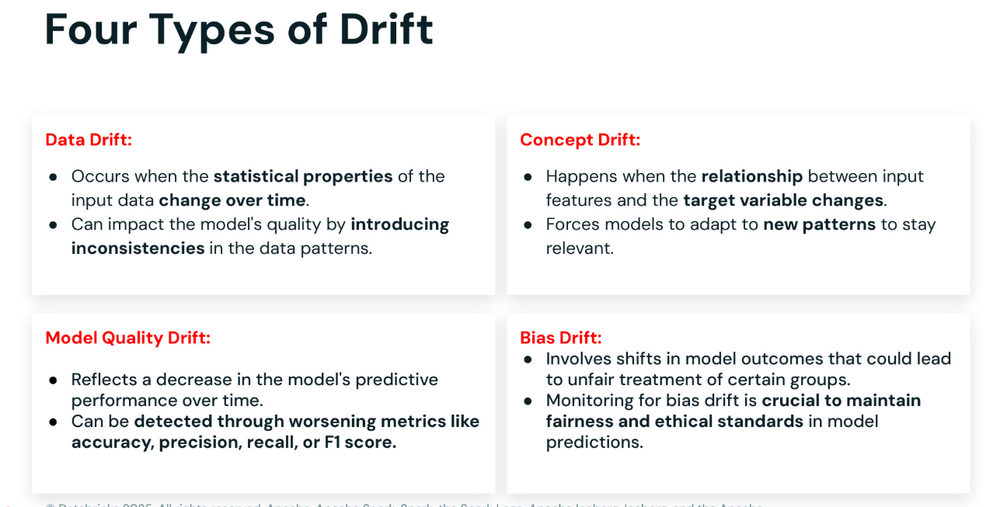
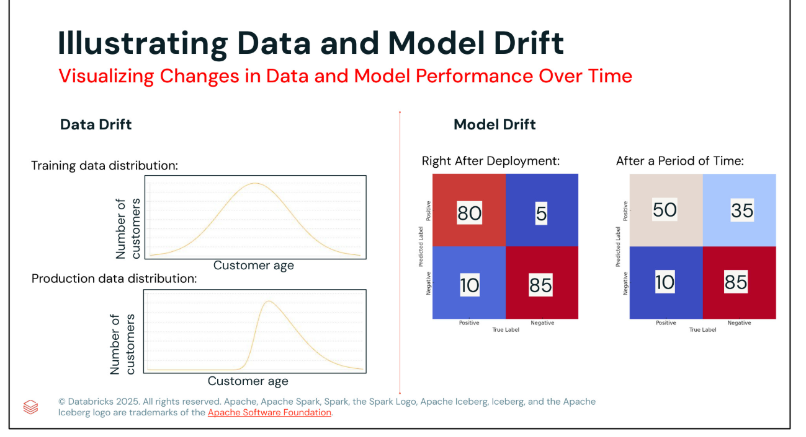
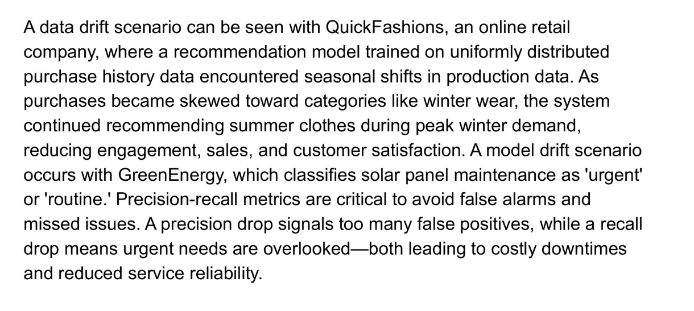

### Monitoring Features
- Data Key metricks: avg, std, null counts, distinct etc.
- Time Granularity: over window every day, 5 minutes, over N weeks
- Data Slices: state, product_class, cart_total > 1000
- Tables, Views, ML models: quality / drift monitoring


### Monitoring available by UI and SDK
- [Official documentation page](https://docs.databricks.com/sap/en/create-lakehouse-monitor-api)

```python
# import databricks.lakehouse_monitoring as lm

# set-up monitoring params

lm.create_monitor(
    table_name='my_UC_table_name',
    
)

lm.run_refresh('my_table')
```

### Monitoring point
- Ongoing evaluation
- Logging of key metricks
- Diagnose issues
- Data for monitoring:
- - Input Data
- - Data in feature stores / vector DB
- - Human feedbacks
- - Mid-training checkpoint analysis
- - Model Evaluation metricks


### Table metrics
- create_or_update_monitor -set-up monitoring for a table
- refresh_metrics - at the end of the pipeline, refresh the monitoring metrics for the table


### Export endpoint observability for alerting 

- Metrics: Ready-to-use metrics dashboards for endpoints
- Alerting: set up alerting for endpoint performance, latency, error rates, etc.
- External Export API: export your endpoint metricks with our export API

API for External integration:

```python
import json
import requests

def get_export_metric_for_model(token: str, workspace_url: str, model_name: str) -> dict:
    url = workspace_url + f'a[o/2.0/preview/model-serving-api/endpoints/v2/metrics?registered_model_name={model_name}'
    headers = {
        "Authorization": f"Bearer {token}",
        "Content-Type": "application/json"
    }
    response = requests.get(url, headers=headers)
    if response.status_code == 200:
        print("Metrics retrieved successfully.")
    else:
        print(f"Failed to retrieve metrics: {response.text}")
    return response.json()
```

### ML Model Retraining Triggers

- Scheduled Retraining: Test with Scheduled/Periodic after this move to triggered
- Data Changes: data change trigger a retraining job or it can be automated if data drift is detected
- Model Code Changes: PR`merge or main branch updated
- Model Configuration Changes: Alternations in the model configuration - initiate a retraining job
- Monitoring and Alerts: detect data/model drift -> send to Databricks SQL dashboards for status display and sent alerts



